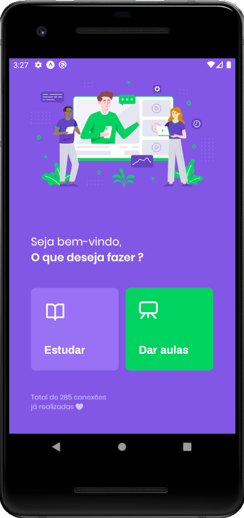
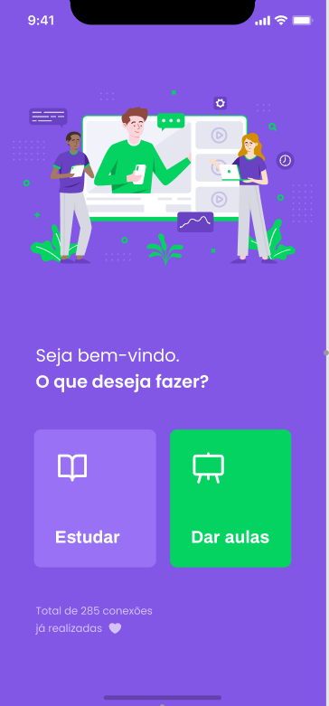
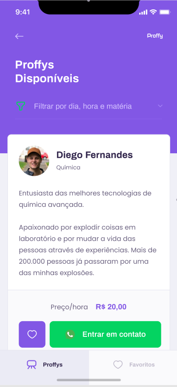
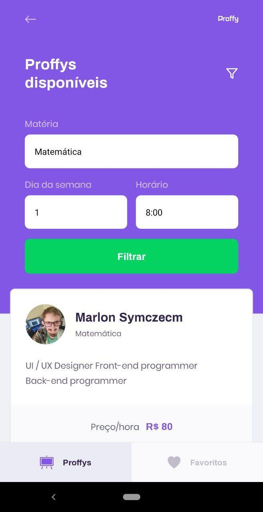
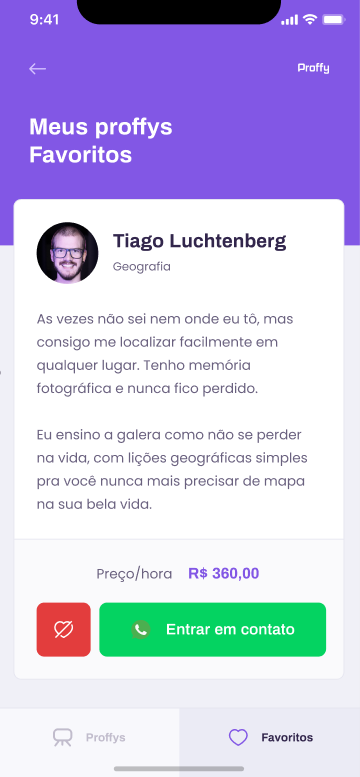

# Next Level Week #2 - Rocketseat - PROFFY - Mobile

# Projeto

O projeto que está sendo desenvolvido é uma plataforma online para que possa ter uma interatividade entre professores e alunos, podendo assim o aluno contratar um professor particular para matéria que necessitar.

O projeto está sendo feito em 3 etapas:
- Primeira etapa a criação da api
- Segunda etapa o aplicativo web já responsivo e com a conexão com banco de dados
- Terceira etapa o aplicativo mobile desenvolvido em React Native

O projeto contem a primeira tela que á landing, possuindo a logo, descrição do que tem nela, dois botões fantásticos, um sendo para listagem dos professores para conseguir uma conexão com algum deles, e o outro botão é para o professor que quiser dar aulas, clicar nele e se inscrever na plataforma, contando um pouco de si com sua biografia, avatar, nome completo, matérias e horários que vai atender.
Na página principal ainda possuí uma amostragem de quantas conexões já foram realizadas também.
Essa página pode ser vista na capa aqui do README.# Projeto

O projeto que está sendo desenvolvido é uma plataforma online para que possa ter uma interatividade entre professores e alunos, podendo assim o aluno contratar um professor particular para matéria que necessitar.

O projeto está sendo feito em 3 etapas:
- Primeira etapa a criação da api
- Segunda etapa o aplicativo web já responsivo e com a conexão com banco de dados
- Terceira etapa o aplicativo mobile desenvolvido em React Native

O projeto contem a primeira tela que á landing, possuindo a logo, descrição do que tem nela, dois botões fantásticos, um sendo para listagem dos professores para conseguir uma conexão com algum deles, e o outro botão é para o professor que quiser dar aulas, clicar nele e se inscrever na plataforma, contando um pouco de si com sua biografia, avatar, nome completo, matérias e horários que vai atender.
Na página principal ainda possuí uma amostragem de quantas conexões já foram realizadas também.
Essa página pode ser vista na capa aqui do README.

A seguir será mostrado as telas de como ficou o aplicativo final.

- A primeira tela é a inicial, contendo dois botões para dar aulas ou entrar em contato com algum professor cadastrado na plataforma já, e também tem a listagem de quantas conexões já foram feitas no aplicativo:

- A segunda tela é que mostra os professores disponíveis após fazer o filtro que será mostrado logo a seguir.
Aqui será mostrado o perfil do professor contendo o botão para entrar em contato via whatsapp registrado:

- Aqui abaixo será mostrado os filtros de como é pesquisado por um novo professor no aplicativo.
Na semana está sendo usado numeral por ainda não estar aplicado um input do tipo select, que será implementado com o avançar do conhecimento da pessoa dona dessa conta do github:

- Na última tela é mostrado a tab dos favoritos, pois quando uma pessoa dá um favoritar no professor filtrado, ele vai para a aba do lado do Proffys, assim ficando sempre lá, sendo salvo no Storage local do celular:

# Stack

A stack que está sendo utilizado é toda baseada em JS, está sendo feito o projeto em React Native consumindo uma API em node-js.

# Funcionalidades

Agora será listado as funcionalidades que o aplicativo web tem até o momento:

- Listagem de professores disponíveis
- Listagem das conexões já feitas com os professores
- Listagem por hora e matéria de professores
- Cadastro de novos professores com suas matérias, hora de atendimento, e também o custo por hora|

# Autor

Agradeço por ter acompanhdo o projeto, e bora voar juntos nessa stack que só cresce.

Aluno: **Marlon Symczecym**
Instrutor: **Diego Fernandes**